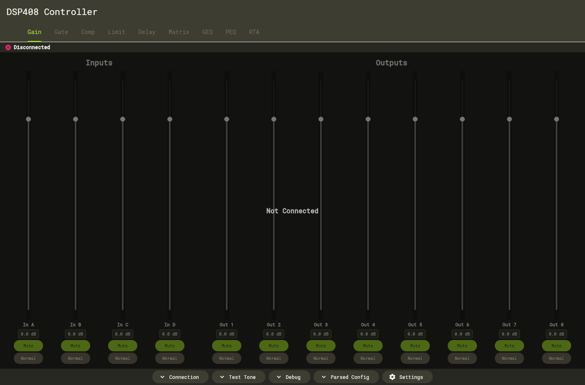
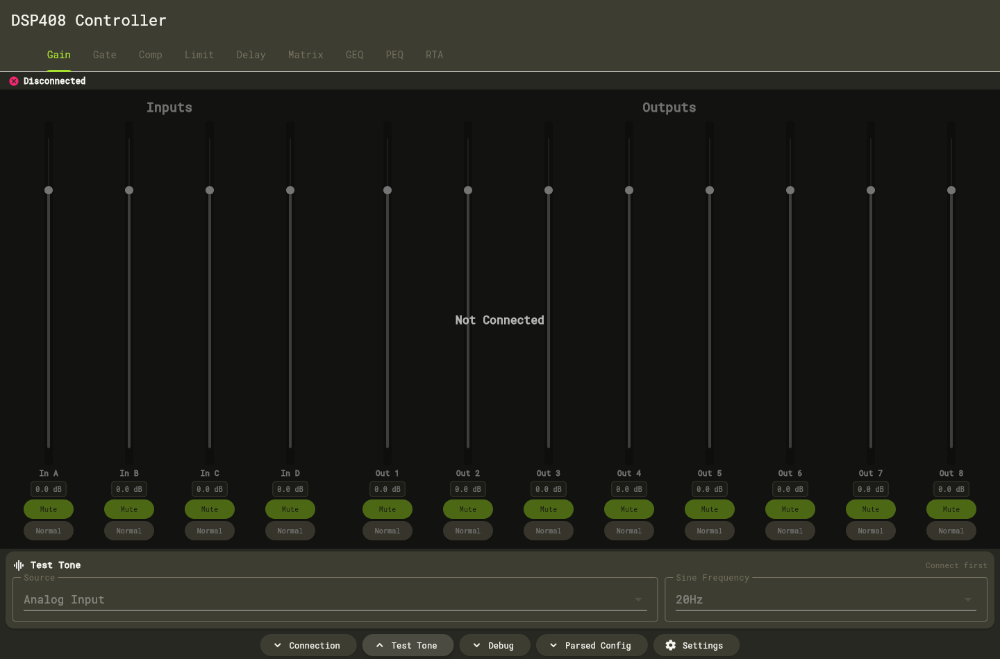
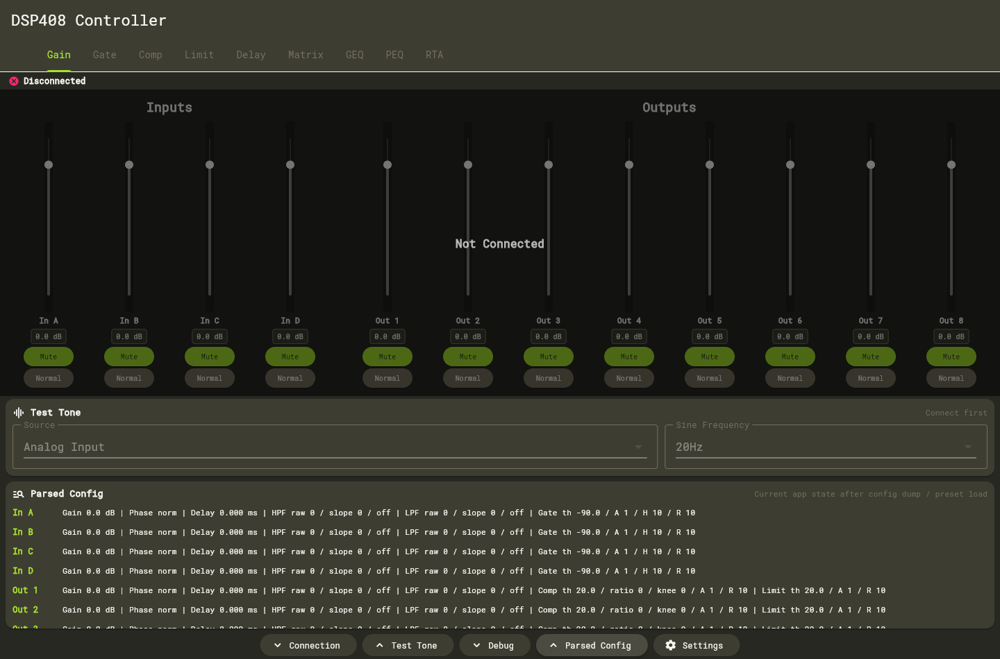

# T.Racks DSP XXX Controller

Flutter controller and reverse-engineering workspace for Thomann t.racks DSP processors.

This fork currently targets the **t.racks DSP 408** first. DSP 204 and DSP 206 support is planned through device profiles, but hardware validation has not started yet.

> Warning: this project is still under active testing. Use it carefully, preferably on a muted or non-critical setup. Do not rely on it yet for live sound, production presets, or unattended operation.

## Screenshots

These screenshots are generated from the app without a connected DSP. They do not include packet captures, private network data, or screenshots from the official editor.







## Current Status

### Implemented for DSP408

- TCP connection to the DSP editor port, default `9761`.
- Saved connection profiles with name, host, and port.
- Preset list, preset load, and preset save workflow.
- Gain tab:
  - input/output gain,
  - mute,
  - phase normal/invert,
  - level meters.
- Matrix tab:
  - input-to-output routing,
  - matrix attenuation per crossing point.
- GEQ tab:
  - 31-band input GEQ,
  - GEQ bypass,
  - GEQ reset through 31 band reset commands.
- PEQ tab:
  - 8 input PEQ bands,
  - 9 output PEQ bands,
  - PEQ type, frequency, Q, gain, and band bypass,
  - HPF/LPF command sending.
- Dynamics tabs:
  - Gate on inputs,
  - Compressor on outputs,
  - Limiter on outputs,
  - Delay on inputs and outputs,
  - values parsed from the DSP408 config dump where known.
- Bottom tools:
  - Connection,
  - Test Tone,
  - Debug log,
  - Parsed Config,
  - Settings.
- Capture helper tools under `tools/capture_helper/`.
- DSP408 protocol notes under `docs/devices/t_racks_dsp_408/`.

### Experimental / Use With Care

- DSP408 hardware testing is still in progress.
- HPF/LPF output config parsing is intentionally not trusted yet. Commands can be sent, but automatic read-back from the config dump still needs validation.
- Link and Copy are documented from noisy captures but are not implementation-ready.
- File import/export, Setting ID/IP, and Lock are not implemented.
- DSP204 and DSP206 are documentation/scenario targets only for now.
- Web builds are useful for UI preview, but real DSP control requires a native app because browsers cannot open raw TCP sockets to the DSP.

## What Is Not Published

The repository intentionally excludes:

- `.pcapng` packet captures,
- local capture journals,
- official editor screenshots,
- local scratch scripts,
- machine-specific logs,
- generated build output.

See `.gitignore` and `docs/devices/t_racks_dsp_408/CAPTURE_WORKFLOW.md` for the capture workflow and privacy rules.

## Repository Layout

```text
lib/
  devices/t_racks408/       DSP408 protocol, providers, widgets
  services/                 app-level services
tools/capture_helper/       guided capture helper and scenarios
docs/
  CHANGELOG.md
  development/              environment, testing, roadmap
  devices/
    t_racks_dsp_408/        protocol notes and capture workflow
    t_racks_dsp_204/        future support notes
    t_racks_dsp_206/        future support notes
  images/                   README screenshots
test/                       protocol, parser, provider, and smoke tests
```

## Requirements

- Flutter `3.38.9`
- Dart `3.10.8`
- Windows is the primary tested target for real DSP work.
- Wireshark is optional, but recommended for protocol capture work:
  - `dumpcap.exe`
  - `tshark.exe`

## Build

```powershell
make setup
make build-windows
```

Windows executable:

```text
build/windows/x64/runner/Release/dsp.exe
```

Direct Flutter command:

```powershell
flutter build windows
```

## Test

```powershell
flutter analyze
flutter test
```

Current automated tests cover command builders, config parsing, connection profile storage, debug log export, and app smoke rendering.

Hardware tests are still manual and ongoing.

## DSP Connection Notes

- Example DSP IP used during local testing: `192.168.0.99`.
- Default TCP port: `9761`.
- The app must run as a native desktop/mobile app to control the DSP.
- Before changing real presets, test with low levels, muted outputs, or a non-critical preset slot.

## Capture Workflow

Use the helper:

```powershell
tools\capture_helper\run_capture_helper.ps1
```

The helper guides manual actions in the official editor and starts/stops `dumpcap` with stable names and JSON timestamps. Captures are local-only and must not be committed by default.

## Development Branch

Current active development branch:

```text
dev/dsp408-protocol-tools
```

The fork remote is:

```text
https://github.com/Alan-Dgs/T.Racks-DSP-XXX
```

## License

This fork keeps the upstream project license. See `LICENSE`.
