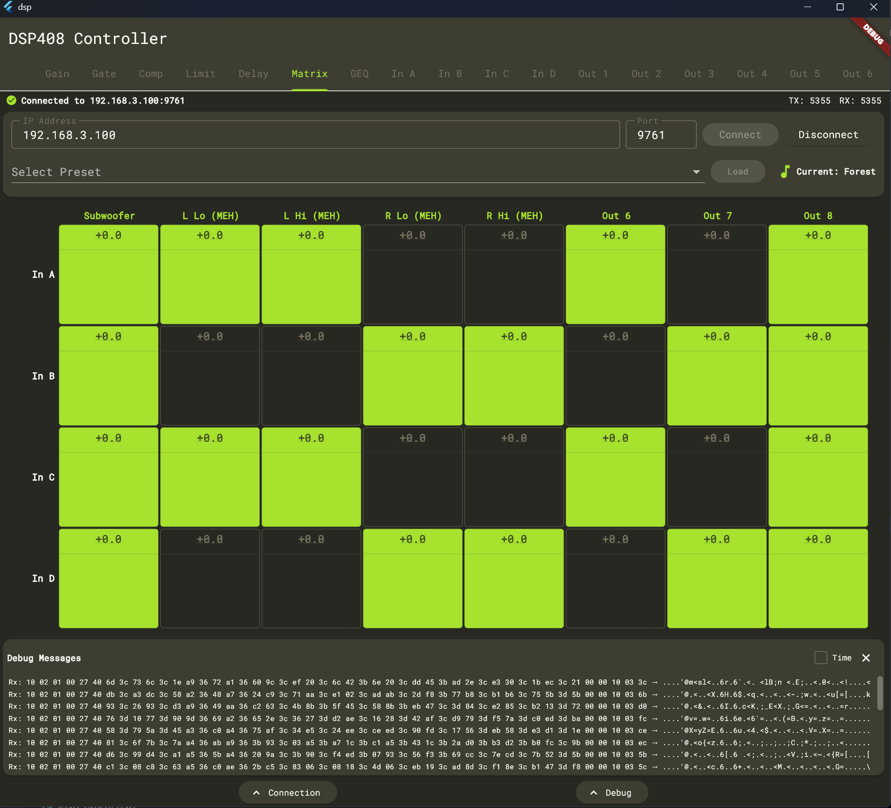

# dsp-408-ui

This application presents a neat and easy way to interface with the t.racks 408 Digital Signal Processor
(DSP). This software communicates over the local intranet and mimics communications sent by the t.racks
DSP Processor Editor software provided by Thomann. The goal is to turn one of the cheapest and most
versatile pieces of live music hardware into something that is capable of having robust mixing
functionality over a wide array of platforms.




## Supported Platforms

**In Active Development:**
- t.racks DSP 408
- Windows
- Android

**Untested:**
- iOS (but it theoretically works)
- MacOS (but it theoretically works)
- t.racks DSP 204 (probably doesn't work yet--will work on this later)

## Feature Parity

**Features that work:**
- Gain
    - Volume Adjust Channels
    - Volume Visualizer Channels
    - Mute/Unmute Channels
- Matrix
    - Assign Inputs -> Outputs

**Features that are in active development:**
- Gain
    - Invert Phase Toggle
- Matrix
    - Volume attenuation for inputs
- Gate
- Compressor
- Limit
- Delay
- GEQ
- PEQ:
    - In A, B, C, and D
    - Out 1, 2, 3, 4, 5, 6, 7, 8

## Getting Started

### Building an .exe file
0. Ensure that Flutter is installed on your computer. If you're running Windows, you will need to ensure that `flutter` is installed and on your `$PATH`. You will need:
    - Flutter - 3.38.9
    - Dart - 3.10.8
1. Run setup:
```
$ make setup
```
2. Build the project:
```
$ make build-windows
```
3. Run the `.exe` file generated at `./build/
4. Connect your DSP to your local network. Input the IP address of the DSP in the field.