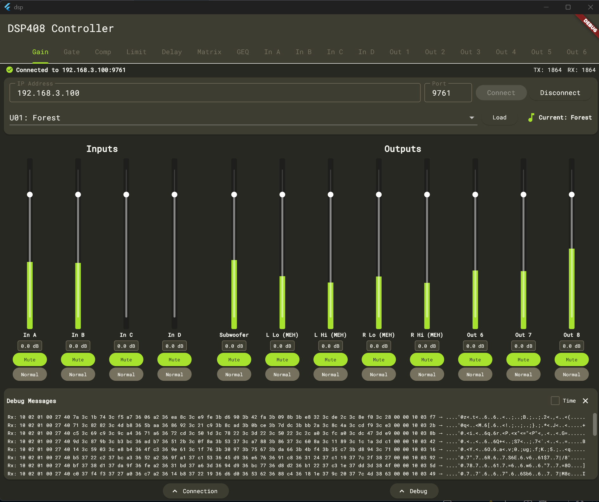

# dsp-408-ui

This application presents a neat and easy way to interface with the t.racks 408 Digital Signal Processor (DSP). This software communicates over Ethernet and mimics the t.racks DSP Processor Editor software provided by Thomann. The goal is to turn one of the cheapest and most versatile pieces of live music hardware into something that is capable of having robust mixing functionality over a wide array of platforms.



## Supported Platforms

**In Active Development:**
- Windows
- MacOS

**Coming Soon:**
- Android
- iOS

## Feature Parity

**Features that work:**
- Gain
    - Volume Adjust Channels
    - Volume Visualizer Channels
    - Mute/Unmute Channels
- Matrix
    - Assign Inputs -> Outputs

**Features that are in active development:**
- Gain
    - Inverse Toggle
- Matrix
    - Volume attenuation for inputs
- Gate
- Compressor
- Limit
- Delay
- GEQ
- PEQ:
    - In A, B, C, and D
    - Out 1, 2, 3, 4, 5, 6, 7, 8

## Getting Started

0. Ensure that Flutter is installed on your computer. You will need:
- Flutter - 3.38.9
- Dart - 3.10.8

1. Run the Makefile:
```
$ make setup
```

2. Build on Windows:
```
$ make build
```

3. Connect your DSP to your local network. Input the IP address in the field.